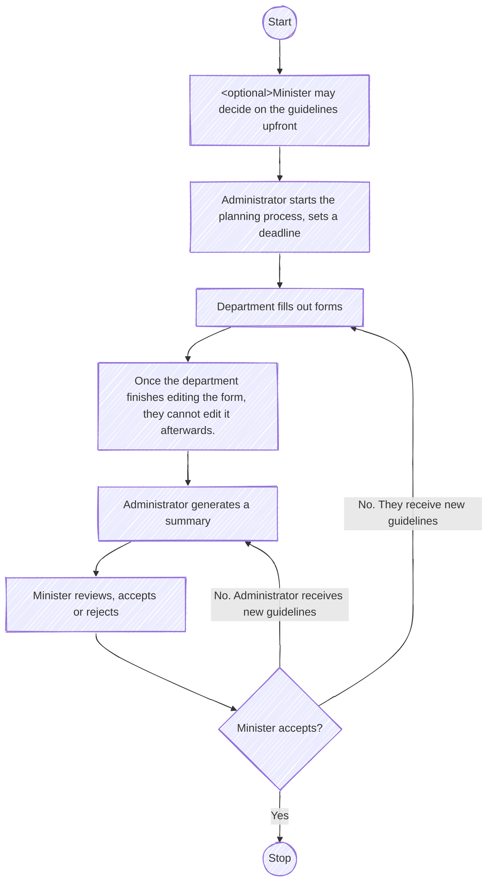

# Zgrany Budżet

Authors: Grzegorz Krajewski, Artur Pawelczyk, Wojciech Skwierawski, Michał Ciesielski

## Flow



## Installation

Install [Poetry](https://python-poetry.org/docs/) first. 
Then run:
```bash
poetry install
```

## Running the Application

Just 
```bash
make
```

## Testing and Linting
```
make test
make lint
```

## Activating Virtual Environment
```
$(poetry env activate)
```

## Initialize the database
```
make init-db
```

## Run with Docker

1. **Build the image:**
   ```bash
   docker build -t budget .
   ```

2. **Run the container:**
   ```bash
   docker run -d -p 5000:5000 --name budget -v $(pwd)/uploads:/app/flaskr/static/uploads budget
   ```
