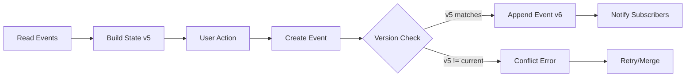

# Optimistic Locking Implementation Guide

**Date:** 2025-12-13  
**Scope:** Event Store and Query Models in `flaskr/events/` and `flaskr/planning/`

---

## Table of Contents

1. [Introduction](#introduction)
2. [Current Architecture Analysis](#current-architecture-analysis)
3. [Optimistic Locking Concepts](#optimistic-locking-concepts)
4. [Implementation Strategy](#implementation-strategy)
5. [Event Store Optimistic Locking](#event-store-optimistic-locking)
6. [Query Model Optimistic Locking](#query-model-optimistic-locking)
7. [Conflict Resolution Patterns](#conflict-resolution-patterns)
8. [Testing Strategy](#testing-strategy)
9. [Migration Path](#migration-path)
10. [References](#references)

---

## Introduction

### What is Optimistic Locking?

Optimistic locking is a concurrency control mechanism that assumes conflicts are rare. Instead of locking resources, it:
- Allows multiple transactions to proceed concurrently
- Detects conflicts at commit time using version numbers or timestamps
- Rejects conflicting updates and requires retry

### Why Implement It?

In the current event-sourced budget planning system:
- **Multiple users** (Minister, Chief, Office staff) modify shared state
- **Race conditions** can occur when reading and updating `EXPENSES` or `PlanningState`
- **Lost updates** may happen without version control
- **Concurrent event emissions** could create inconsistent state

---

## Current Architecture Analysis

### Event Store Structure

```python
# flaskr/events/event_store.py
class DefaultEventStore(EventStore):
    def __init__(self, event_repository: EventRepository):
        self._subscribers: dict[type, list[Callable]] = {}
        self._event_repository = event_repository
        self._lock = threading.Lock()  # Basic thread safety
    
    def emit(self, event: Any) -> None:
        with self._lock:
            self._event_repository.store(event)
        self._notify_subscribers(event)
```

**Current Issues:**
- ✅ Has basic thread safety via `threading.Lock()`
- ❌ No version tracking for events
- ❌ No aggregate version validation
- ❌ File-based storage lacks atomic operations
- ❌ No conflict detection mechanism

### Query Model Structure

```python
# flaskr/planning/state.py
EXPENSES: dict[str, list[Expense]] = {office: [] for office in OFFICES}
EXPENSES_CLOSED = {office: False for office in OFFICES}

class PlanningState:
    def __init__(self, event_store: EventStore | None = None):
        self.deadline: str | None = None
        self.status = PlanningStatus.NOT_STARTED
        # ... subscribes to events
```

**Current Issues:**
- ❌ Global mutable state (`EXPENSES`, `EXPENSES_CLOSED`)
- ❌ No version tracking on read models
- ❌ Direct mutation without version checks
- ❌ Race conditions in multi-threaded Flask environment

### Usage Pattern Example

```python
# flaskr/planning/expenses/__init__.py
@expenses_bp.route("/add", methods=["POST"])
def add_expense():
    # 1. Read current state (no version captured)
    can_edit = planning_state.status == PlanningStatus.IN_PROGRESS
    
    # 2. Validate
    if EXPENSES_CLOSED[session["role"]] or not can_edit:
        return redirect(...)
    
    # 3. Mutate directly (no version check)
    EXPENSES[session["role"]].append(expense)  # ⚠️ Race condition!
```

**Problem Scenario:**
1. User A reads `EXPENSES` (10 items)
2. User B reads `EXPENSES` (10 items)
3. User A adds expense → 11 items
4. User B adds expense → overwrites to 11 items (User A's update lost!)

---

## Optimistic Locking Concepts

### Version-Based Approach

Each aggregate (event stream) has a version number:

```python
@dataclass
class AggregateVersion:
    aggregate_id: str
    version: int  # Increments with each event
    last_event_id: str
```

**Rules:**
- Read operations capture the current version
- Write operations include expected version
- Store rejects writes if version doesn't match

### Event Sourcing Pattern



### Timestamp-Based Approach

Alternative to version numbers:

```python
@dataclass
class TimestampedState:
    data: dict
    last_modified: datetime
    etag: str  # Hash of data + timestamp
```

**Trade-offs:**

| Approach | Pros | Cons |
|----------|------|------|
| **Version Number** | Simple, deterministic, easy to debug | Requires counter storage |
| **Timestamp** | No counter needed, natural ordering | Clock skew issues, less precise |
| **ETag (Hash)** | Content-based, detects any change | Computation overhead |

---

## Implementation Strategy

### Phase 1: Event Store Versioning

#### 1.1 Add Version Tracking to Events

```python
# flaskr/events/event_repository.py
from dataclasses import dataclass
from datetime import datetime, timezone
import uuid

@dataclass
class EventEnvelope:
    """Wrapper for events with metadata."""
    event_id: str
    aggregate_id: str
    aggregate_type: str
    version: int
    timestamp: datetime
    event_type: str
    event_module: str
    payload: dict

class VersionedEventRepository(Protocol):
    def store(
        self, 
        aggregate_id: str,
        aggregate_type: str,
        expected_version: int,
        event: Any
    ) -> EventEnvelope:
        """
        Store event with optimistic locking.
        
        Raises:
            ConcurrencyError: If expected_version doesn't match current version
        """
        ...
    
    def get_version(self, aggregate_id: str) -> int:
        """Get current version of aggregate."""
        ...
    
    def load_events(
        self, 
        aggregate_id: str,
        from_version: int = 0
    ) -> list[EventEnvelope]:
        """Load events for aggregate from specific version."""
        ...
```

#### 1.2 Implement File-Based Versioned Repository

```python
# flaskr/events/versioned_file_repository.py
import json
import fcntl  # For file locking on Unix
from pathlib import Path
from typing import Any

class ConcurrencyError(Exception):
    """Raised when optimistic locking fails."""
    def __init__(self, aggregate_id: str, expected: int, actual: int):
        self.aggregate_id = aggregate_id
        self.expected_version = expected
        self.actual_version = actual
        super().__init__(
            f"Concurrency conflict for {aggregate_id}: "
            f"expected v{expected}, actual v{actual}"
        )

class VersionedFileEventRepository:
    def __init__(self, events_dir: str = "events"):
        self._events_dir = Path(events_dir)
        self._events_dir.mkdir(exist_ok=True)
        self._version_file = self._events_dir / "versions.json"
        self._init_version_file()
    
    def _init_version_file(self) -> None:
        if not self._version_file.exists():
            self._version_file.write_text("{}")
    
    def _get_aggregate_file(self, aggregate_id: str) -> Path:
        # Use safe filename
        safe_id = aggregate_id.replace("/", "_")
        return self._events_dir / f"{safe_id}.jsonl"
    
    def get_version(self, aggregate_id: str) -> int:
        """Thread-safe version read."""
        with open(self._version_file, 'r') as f:
            fcntl.flock(f.fileno(), fcntl.LOCK_SH)  # Shared lock
            try:
                versions = json.load(f)
                return versions.get(aggregate_id, 0)
            finally:
                fcntl.flock(f.fileno(), fcntl.LOCK_UN)
    
    def store(
        self,
        aggregate_id: str,
        aggregate_type: str,
        expected_version: int,
        event: Any
    ) -> EventEnvelope:
        """
        Store event with optimistic locking.
        
        Algorithm:
        1. Acquire exclusive lock on version file
        2. Read current version
        3. Verify expected_version matches
        4. Increment version
        5. Write event to aggregate stream
        6. Update version file
        7. Release lock
        """
        with open(self._version_file, 'r+') as vf:
            fcntl.flock(vf.fileno(), fcntl.LOCK_EX)  # Exclusive lock
            try:
                # Read current versions
                vf.seek(0)
                versions = json.load(vf)
                current_version = versions.get(aggregate_id, 0)
                
                # Optimistic lock check
                if current_version != expected_version:
                    raise ConcurrencyError(
                        aggregate_id, expected_version, current_version
                    )
                
                # Create event envelope
                new_version = current_version + 1
                envelope = EventEnvelope(
                    event_id=str(uuid.uuid4()),
                    aggregate_id=aggregate_id,
                    aggregate_type=aggregate_type,
                    version=new_version,
                    timestamp=datetime.now(timezone.utc),
                    event_type=type(event).__name__,
                    event_module=type(event).__module__,
                    payload=event.__dict__ if hasattr(event, '__dict__') 
                            else event.to_dict()
                )
                
                # Append to aggregate stream
                aggregate_file = self._get_aggregate_file(aggregate_id)
                with open(aggregate_file, 'a') as af:
                    json.dump(envelope.__dict__, af, default=str)
                    af.write('\n')
                    af.flush()
                
                # Update version
                versions[aggregate_id] = new_version
                vf.seek(0)
                vf.truncate()
                json.dump(versions, vf, indent=2)
                vf.flush()
                
                return envelope
                
            finally:
                fcntl.flock(vf.fileno(), fcntl.LOCK_UN)
    
    def load_events(
        self, 
        aggregate_id: str,
        from_version: int = 0
    ) -> list[EventEnvelope]:
        """Load events for aggregate."""
        aggregate_file = self._get_aggregate_file(aggregate_id)
        if not aggregate_file.exists():
            return []
        
        events = []
        with open(aggregate_file, 'r') as f:
            for line in f:
                envelope_data = json.loads(line)
                # Reconstruct EventEnvelope
                envelope = EventEnvelope(**envelope_data)
                if envelope.version > from_version:
                    events.append(envelope)
        
        return events
    
    def destroy(self) -> None:
        """Cleanup resources."""
        pass
```

> [!IMPORTANT]
> **File Locking Limitations:**
> - `fcntl.flock()` only works on Unix/Linux (not Windows)
> - For Windows compatibility, use `msvcrt.locking()` or a database
> - For production, consider PostgreSQL with `SELECT FOR UPDATE`

#### 1.3 Update EventStore to Use Versions

```python
# flaskr/events/versioned_event_store.py
from typing import Protocol, Callable, Any
import inspect
from .versioned_file_repository import VersionedFileEventRepository, ConcurrencyError

class VersionedEventStore:
    def __init__(self, repository: VersionedFileEventRepository):
        self._repository = repository
        self._subscribers: dict[type, list[Callable]] = {}
        self._lock = threading.Lock()
    
    def emit(
        self, 
        aggregate_id: str,
        aggregate_type: str,
        expected_version: int,
        event: Any,
        retry_count: int = 3
    ) -> EventEnvelope:
        """
        Emit event with optimistic locking.
        
        Args:
            aggregate_id: Unique identifier for aggregate
            aggregate_type: Type of aggregate (e.g., "PlanningState")
            expected_version: Version we expect aggregate to be at
            event: Event to emit
            retry_count: Number of retries on conflict
        
        Returns:
            EventEnvelope with new version
        
        Raises:
            ConcurrencyError: If all retries fail
        """
        for attempt in range(retry_count):
            try:
                envelope = self._repository.store(
                    aggregate_id, aggregate_type, expected_version, event
                )
                self._notify_subscribers(event)
                return envelope
            except ConcurrencyError as e:
                if attempt == retry_count - 1:
                    raise  # Last attempt, propagate error
                # Retry with updated version
                expected_version = self._repository.get_version(aggregate_id)
    
    def get_version(self, aggregate_id: str) -> int:
        """Get current version of aggregate."""
        return self._repository.get_version(aggregate_id)
    
    # ... rest of EventStore methods
```

### Phase 2: Query Model Versioning

#### 2.1 Add Version to PlanningState

```python
# flaskr/planning/versioned_state.py
from dataclasses import dataclass
from typing import Optional

@dataclass
class VersionedPlanningState:
    """Planning state with version tracking."""
    aggregate_id: str = "planning-2025"  # One per planning year
    version: int = 0
    
    # State fields
    deadline: Optional[str] = None
    status: PlanningStatus = PlanningStatus.NOT_STARTED
    correction_comment: Optional[str] = None
    planning_year: int = 2025
    
    def __init__(self, event_store: VersionedEventStore):
        self.event_store = event_store
        self.aggregate_id = f"planning-{self.planning_year}"
        
        # Load current version
        self.version = event_store.get_version(self.aggregate_id)
        
        # Subscribe to events
        event_store.add_subscriber(self._handle_planning_started)
        # ... other subscribers
    
    def start_planning(self, deadline: str) -> None:
        """Start planning with optimistic locking."""
        if self.status not in (PlanningStatus.NOT_STARTED, PlanningStatus.NEEDS_CORRECTION):
            raise ValueError(f"Cannot start planning in state {self.status}")
        
        if not deadline:
            raise ValueError("Deadline is required")
        
        try:
            # Emit with current version
            envelope = self.event_store.emit(
                aggregate_id=self.aggregate_id,
                aggregate_type="PlanningState",
                expected_version=self.version,
                event=_PlanningStartedEvent(deadline)
            )
            # Update local version after successful emit
            self.version = envelope.version
        except ConcurrencyError as e:
            # Handle conflict
            raise ValueError(
                f"Planning state was modified by another user. "
                f"Please refresh and try again. "
                f"(Expected v{e.expected_version}, actual v{e.actual_version})"
            )
    
    def _handle_planning_started(self, event: _PlanningStartedEvent) -> None:
        """Event handler - updates state."""
        self.deadline = event.deadline
        self.status = PlanningStatus.IN_PROGRESS
        # Note: version is updated in emit(), not here
```

#### 2.2 Versioned Expense Collection

For the `EXPENSES` dictionary, we need a different approach since it's modified by multiple offices:

```python
# flaskr/planning/versioned_expenses.py
from dataclasses import dataclass, field
from typing import Dict, List
import threading

@dataclass
class OfficeExpenses:
    """Expenses for a single office with version tracking."""
    office_id: str
    expenses: List[Expense] = field(default_factory=list)
    version: int = 0
    closed: bool = False

class VersionedExpenseStore:
    """Thread-safe expense store with per-office versioning."""
    
    def __init__(self, event_store: VersionedEventStore):
        self._event_store = event_store
        self._offices: Dict[str, OfficeExpenses] = {}
        self._lock = threading.RLock()
    
    def get_expenses(self, office_id: str) -> tuple[List[Expense], int]:
        """
        Get expenses and version for office.
        
        Returns:
            (expenses_list, current_version)
        """
        with self._lock:
            office = self._offices.get(office_id)
            if not office:
                office = OfficeExpenses(office_id=office_id)
                self._offices[office_id] = office
            return (office.expenses.copy(), office.version)
    
    def add_expense(
        self, 
        office_id: str, 
        expense: Expense,
        expected_version: int
    ) -> int:
        """
        Add expense with optimistic locking.
        
        Args:
            office_id: Office identifier
            expense: Expense to add
            expected_version: Version we expect office expenses to be at
        
        Returns:
            New version number
        
        Raises:
            ConcurrencyError: If version mismatch
        """
        aggregate_id = f"expenses-{office_id}"
        
        # Create event
        event = ExpenseAddedEvent(
            office_id=office_id,
            expense=expense
        )
        
        # Emit with version check
        envelope = self._event_store.emit(
            aggregate_id=aggregate_id,
            aggregate_type="OfficeExpenses",
            expected_version=expected_version,
            event=event
        )
        
        return envelope.version
    
    def _handle_expense_added(self, event: ExpenseAddedEvent) -> None:
        """Event handler - updates read model."""
        with self._lock:
            office = self._offices.get(event.office_id)
            if not office:
                office = OfficeExpenses(office_id=event.office_id)
                self._offices[event.office_id] = office
            
            office.expenses.append(event.expense)
            office.version += 1
```

#### 2.3 Update Route Handlers

```python
# flaskr/planning/expenses/__init__.py (updated)
from ..versioned_expenses import VersionedExpenseStore
from ...events.versioned_file_repository import ConcurrencyError

@expenses_bp.route("/add", methods=["POST"])
@auth_required
def add_expense() -> str | Response:
    if "role" not in session or session["role"] not in OFFICES:
        return redirect(url_for("planning.index"))
    
    office_id = session["role"]
    
    # Get current expenses and version
    expenses, current_version = expense_store.get_expenses(office_id)
    
    # Check if can edit
    can_edit = planning_state.status == PlanningStatus.IN_PROGRESS
    if not can_edit:
        flash("Planning is not in progress", "error")
        return redirect(url_for("planning.expenses.list_expenses"))
    
    if request.method == "POST":
        # Build expense object
        expense = Expense(
            chapter=request.form.get("chapter"),
            task_name=request.form.get("task_name"),
            financial_needs=request.form.get("budget_2026", type=int),
            role=office_id,
            # ... other fields
        )
        
        try:
            # Add with optimistic locking
            # Version comes from hidden form field or session
            expected_version = int(request.form.get("version", current_version))
            new_version = expense_store.add_expense(
                office_id, expense, expected_version
            )
            
            flash("Expense added successfully", "success")
            return redirect(url_for("planning.expenses.list_expenses"))
            
        except ConcurrencyError as e:
            flash(
                f"Another user modified expenses. Please refresh and try again. "
                f"(Your version: {e.expected_version}, current: {e.actual_version})",
                "error"
            )
            return render_template(
                "add_expense.html",
                expense=expense,  # Pre-fill form
                version=e.actual_version  # Updated version
            )
    
    # GET request - show form with current version
    return render_template(
        "add_expense.html",
        version=current_version  # Pass to template
    )
```

#### 2.4 Update Templates

```html
<!-- templates/add_expense.html -->
<form method="POST" action="{{ url_for('planning.expenses.add_expense') }}">
    <!-- Hidden version field for optimistic locking -->
    <input type="hidden" name="version" value="{{ version }}">
    
    <!-- Rest of form fields -->
    <div>
        <label for="chapter">Chapter:</label>
        <input type="text" id="chapter" name="chapter" 
               value="{{ expense.chapter if expense else '' }}" required>
    </div>
    
    <!-- ... other fields ... -->
    
    <button type="submit">Add Expense</button>
</form>

<!-- Show conflict warning if present -->

    
        
            <div class="alert alert-{{ category }}">
                {{ message }}
            </div>
        
    

```

---

## Conflict Resolution Patterns

### Pattern 1: Reject and Retry (Pessimistic UX)

**When to use:** Critical operations where data integrity is paramount.

```python
def handle_conflict_reject(e: ConcurrencyError):
    """Force user to reload and retry."""
    flash(
        "Data was modified by another user. "
        "Your changes were NOT saved. Please refresh and try again.",
        "error"
    )
    return redirect(url_for("current_page"))
```

**Pros:** Simple, safe  
**Cons:** Poor UX, user loses work

### Pattern 2: Auto-Merge (Optimistic UX)

**When to use:** Non-conflicting changes (different fields).

```python
def handle_conflict_merge(
    user_changes: dict,
    expected_version: int,
    aggregate_id: str
) -> bool:
    """Attempt to merge changes automatically."""
    # Load latest events since expected version
    new_events = event_store.load_events(
        aggregate_id, from_version=expected_version
    )
    
    # Check if changes conflict
    conflicts = detect_conflicts(user_changes, new_events)
    
    if not conflicts:
        # No conflict - replay user's change on latest version
        current_version = event_store.get_version(aggregate_id)
        event_store.emit(
            aggregate_id, 
            aggregate_type,
            current_version,  # Use latest version
            create_event(user_changes)
        )
        flash("Changes merged successfully", "success")
        return True
    else:
        # Conflict detected - reject
        flash(f"Conflicts detected: {conflicts}", "error")
        return False
```

### Pattern 3: Last-Write-Wins (Dangerous)

**When to use:** Only for non-critical data where conflicts are acceptable.

```python
def handle_conflict_force(event: Any, aggregate_id: str):
    """Force write regardless of version (use with caution!)."""
    current_version = event_store.get_version(aggregate_id)
    event_store.emit(
        aggregate_id,
        aggregate_type,
        current_version,  # Use current, ignore expected
        event
    )
    logger.warning(
        f"Forced write to {aggregate_id} - potential data loss!"
    )
```

> [!CAUTION]
> **Last-Write-Wins Risk:**
> This pattern can cause data loss. Only use for:
> - User preferences
> - UI state
> - Non-critical metadata
> 
> **Never use for:**
> - Financial data
> - Audit trails
> - State transitions

### Pattern 4: Three-Way Merge (Advanced)

**When to use:** Collaborative editing scenarios.

```python
def three_way_merge(
    base_state: dict,      # State at expected_version
    user_state: dict,      # User's modified state
    current_state: dict    # Latest state
) -> dict | None:
    """
    Perform three-way merge.
    
    Returns merged state or None if conflicts.
    """
    merged = {}
    
    for key in set(base_state.keys()) | set(user_state.keys()) | set(current_state.keys()):
        base_val = base_state.get(key)
        user_val = user_state.get(key)
        curr_val = current_state.get(key)
        
        if user_val == curr_val:
            # No conflict
            merged[key] = user_val
        elif user_val == base_val:
            # User didn't change, use current
            merged[key] = curr_val
        elif curr_val == base_val:
            # Current didn't change, use user's
            merged[key] = user_val
        else:
            # Both changed - conflict!
            return None
    
    return merged
```

---

## Testing Strategy

### Unit Tests

```python
# tests/test_optimistic_locking.py
import pytest
from flaskr.events.versioned_file_repository import (
    VersionedFileEventRepository,
    ConcurrencyError
)

def test_version_increments_on_store(tmp_path):
    """Test that version increments with each event."""
    repo = VersionedFileEventRepository(str(tmp_path))
    
    # Initial version is 0
    assert repo.get_version("test-aggregate") == 0
    
    # Store first event
    envelope1 = repo.store(
        "test-aggregate", "TestType", 0, TestEvent("data1")
    )
    assert envelope1.version == 1
    assert repo.get_version("test-aggregate") == 1
    
    # Store second event
    envelope2 = repo.store(
        "test-aggregate", "TestType", 1, TestEvent("data2")
    )
    assert envelope2.version == 2
    assert repo.get_version("test-aggregate") == 2

def test_concurrent_writes_fail(tmp_path):
    """Test that concurrent writes are detected."""
    repo = VersionedFileEventRepository(str(tmp_path))
    
    # Both read version 0
    version = repo.get_version("test-aggregate")
    
    # First write succeeds
    repo.store("test-aggregate", "TestType", version, TestEvent("data1"))
    
    # Second write with stale version fails
    with pytest.raises(ConcurrencyError) as exc_info:
        repo.store("test-aggregate", "TestType", version, TestEvent("data2"))
    
    assert exc_info.value.expected_version == 0
    assert exc_info.value.actual_version == 1

def test_retry_with_updated_version(tmp_path):
    """Test retry pattern after conflict."""
    repo = VersionedFileEventRepository(str(tmp_path))
    
    # Initial write
    repo.store("test-aggregate", "TestType", 0, TestEvent("data1"))
    
    # Simulate retry
    try:
        repo.store("test-aggregate", "TestType", 0, TestEvent("data2"))
    except ConcurrencyError:
        # Get updated version and retry
        current_version = repo.get_version("test-aggregate")
        envelope = repo.store(
            "test-aggregate", "TestType", current_version, TestEvent("data2")
        )
        assert envelope.version == 2  # Success!
```

### Integration Tests

```python
# tests/test_versioned_planning_state.py
def test_concurrent_planning_start(app, versioned_event_store):
    """Test that concurrent start_planning calls are handled."""
    state1 = VersionedPlanningState(versioned_event_store)
    state2 = VersionedPlanningState(versioned_event_store)
    
    # Both read version 0
    assert state1.version == 0
    assert state2.version == 0
    
    # First start succeeds
    state1.start_planning("2025-12-31")
    assert state1.version == 1
    
    # Second start fails (stale version)
    with pytest.raises(ValueError, match="modified by another user"):
        state2.start_planning("2025-12-31")
    
    # Refresh state2 and retry
    state2.version = versioned_event_store.get_version(state2.aggregate_id)
    # Now state2 has version 1, but status is already IN_PROGRESS
    # So this will fail for business logic reasons, not concurrency
    with pytest.raises(ValueError, match="Cannot start planning"):
        state2.start_planning("2025-12-31")
```

### E2E Tests

```python
# e2e/test_concurrent_expense_add.py
from playwright.sync_api import Page, expect
import threading

def test_concurrent_expense_addition(page: Page, page2: Page):
    """Test two users adding expenses concurrently."""
    
    # User 1 logs in and navigates to add expense
    page.goto("/login")
    page.fill("#username", "office1")
    page.fill("#password", "password")
    page.click("button[type=submit]")
    page.goto("/expenses/add")
    
    # User 2 logs in (same office)
    page2.goto("/login")
    page2.fill("#username", "office1")
    page2.fill("#password", "password")
    page2.click("button[type=submit]")
    page2.goto("/expenses/add")
    
    # Both fill out forms
    page.fill("#chapter", "12345")
    page.fill("#task_name", "Task A")
    page.fill("#budget_2026", "10000")
    
    page2.fill("#chapter", "67890")
    page2.fill("#task_name", "Task B")
    page2.fill("#budget_2026", "20000")
    
    # User 1 submits first
    page.click("button[type=submit]")
    expect(page.locator(".alert-success")).to_be_visible()
    
    # User 2 submits (should see conflict)
    page2.click("button[type=submit]")
    expect(page2.locator(".alert-error")).to_contain_text("modified")
    
    # User 2 refreshes and resubmits
    page2.reload()
    page2.fill("#chapter", "67890")
    page2.fill("#task_name", "Task B")
    page2.fill("#budget_2026", "20000")
    page2.click("button[type=submit]")
    expect(page2.locator(".alert-success")).to_be_visible()
```

---

## Migration Path

### Step 1: Add Versioning Infrastructure (No Breaking Changes)

1. Create `VersionedFileEventRepository` alongside existing `FileEventRepository`
2. Add version tracking to new aggregates only
3. Run in parallel with existing system
4. **Validation:** Unit tests pass, no production impact

### Step 2: Migrate PlanningState (Low Risk)

1. Create `VersionedPlanningState` class
2. Update `planning_state` singleton to use versioned store
3. Add version field to templates (hidden input)
4. **Rollback plan:** Revert to old `PlanningState` class

### Step 3: Migrate Expense Management (Medium Risk)

1. Create `VersionedExpenseStore`
2. Migrate `EXPENSES` global dict to versioned store
3. Update all expense routes to use versioned API
4. Add conflict handling to templates
5. **Rollback plan:** Keep old `EXPENSES` dict as fallback

### Step 4: Migrate Event Store (High Risk)

1. Implement `VersionedEventStore`
2. Migrate existing events to versioned format
3. Update all `emit()` calls to include version
4. **Rollback plan:** Keep old event store, replay events

### Migration Script Example

```python
# scripts/migrate_to_versioned_events.py
import json
from pathlib import Path
from flaskr.events.versioned_file_repository import VersionedFileEventRepository

def migrate_events(old_events_file: str, new_events_dir: str):
    """Migrate old flat event file to versioned format."""
    repo = VersionedFileEventRepository(new_events_dir)
    
    # Group events by aggregate
    aggregates = {}
    
    with open(old_events_file, 'r') as f:
        for line in f:
            event_data = json.loads(line)
            event_type = event_data["type"]
            
            # Infer aggregate_id from event type
            if "Planning" in event_type:
                aggregate_id = "planning-2025"
                aggregate_type = "PlanningState"
            elif "Expense" in event_type:
                # Extract office from payload
                office = event_data["payload"].get("office_id", "unknown")
                aggregate_id = f"expenses-{office}"
                aggregate_type = "OfficeExpenses"
            else:
                continue
            
            if aggregate_id not in aggregates:
                aggregates[aggregate_id] = []
            
            aggregates[aggregate_id].append({
                "type": aggregate_type,
                "data": event_data
            })
    
    # Store events with versions
    for aggregate_id, events in aggregates.items():
        for i, event_info in enumerate(events):
            # Reconstruct event object
            event_class = getattr(
                importlib.import_module(event_info["data"]["module"]),
                event_info["data"]["type"]
            )
            event = event_class(**event_info["data"]["payload"])
            
            # Store with version
            repo.store(
                aggregate_id=aggregate_id,
                aggregate_type=event_info["type"],
                expected_version=i,  # Sequential
                event=event
            )
    
    print(f"Migrated {len(aggregates)} aggregates")

if __name__ == "__main__":
    migrate_events("events.jsonl", "events_versioned")
```

---

## References

### Event Sourcing

- [Martin Fowler - Event Sourcing](https://martinfowler.com/eaaDev/EventSourcing.html)
- [Greg Young - CQRS and Event Sourcing](https://www.youtube.com/watch?v=JHGkaShoyNs)
- [Event Store Documentation](https://www.eventstore.com/event-sourcing)

### Optimistic Locking

- [Microsoft - Optimistic Concurrency](https://docs.microsoft.com/en-us/ef/core/saving/concurrency)
- [PostgreSQL - Optimistic Locking Patterns](https://www.postgresql.org/docs/current/applevel-consistency.html)
- [HTTP ETags for Optimistic Locking](https://developer.mozilla.org/en-US/docs/Web/HTTP/Headers/ETag)

### Conflict Resolution

- [Operational Transformation](https://en.wikipedia.org/wiki/Operational_transformation)
- [CRDTs - Conflict-Free Replicated Data Types](https://crdt.tech/)
- [Three-Way Merge Algorithms](https://en.wikipedia.org/wiki/Merge_(version_control)#Three-way_merge)

### Python Concurrency

- [Python Threading Documentation](https://docs.python.org/3/library/threading.html)
- [File Locking with fcntl](https://docs.python.org/3/library/fcntl.html)
- [Multiprocessing vs Threading](https://realpython.com/python-concurrency/)

---

## Appendix: Alternative Implementations

### Database-Based Versioning (PostgreSQL)

For production systems, consider using PostgreSQL:

```python
# flaskr/events/postgres_versioned_repository.py
import psycopg2
from psycopg2.extras import Json

class PostgresVersionedRepository:
    def __init__(self, connection_string: str):
        self.conn = psycopg2.connect(connection_string)
        self._init_schema()
    
    def _init_schema(self):
        with self.conn.cursor() as cur:
            cur.execute("""
                CREATE TABLE IF NOT EXISTS events (
                    event_id UUID PRIMARY KEY,
                    aggregate_id VARCHAR(255) NOT NULL,
                    aggregate_type VARCHAR(100) NOT NULL,
                    version INTEGER NOT NULL,
                    timestamp TIMESTAMPTZ NOT NULL,
                    event_type VARCHAR(100) NOT NULL,
                    event_module VARCHAR(255) NOT NULL,
                    payload JSONB NOT NULL,
                    UNIQUE(aggregate_id, version)
                );
                
                CREATE INDEX IF NOT EXISTS idx_aggregate 
                ON events(aggregate_id, version);
            """)
            self.conn.commit()
    
    def store(
        self,
        aggregate_id: str,
        aggregate_type: str,
        expected_version: int,
        event: Any
    ) -> EventEnvelope:
        """Store with database-level optimistic locking."""
        with self.conn.cursor() as cur:
            # Get current version with row lock
            cur.execute(
                """
                SELECT COALESCE(MAX(version), 0) 
                FROM events 
                WHERE aggregate_id = %s
                FOR UPDATE
                """,
                (aggregate_id,)
            )
            current_version = cur.fetchone()[0]
            
            # Check version
            if current_version != expected_version:
                raise ConcurrencyError(
                    aggregate_id, expected_version, current_version
                )
            
            # Insert event
            new_version = current_version + 1
            envelope = EventEnvelope(
                event_id=str(uuid.uuid4()),
                aggregate_id=aggregate_id,
                aggregate_type=aggregate_type,
                version=new_version,
                timestamp=datetime.now(timezone.utc),
                event_type=type(event).__name__,
                event_module=type(event).__module__,
                payload=event.__dict__
            )
            
            cur.execute(
                """
                INSERT INTO events 
                (event_id, aggregate_id, aggregate_type, version, 
                 timestamp, event_type, event_module, payload)
                VALUES (%s, %s, %s, %s, %s, %s, %s, %s)
                """,
                (
                    envelope.event_id,
                    envelope.aggregate_id,
                    envelope.aggregate_type,
                    envelope.version,
                    envelope.timestamp,
                    envelope.event_type,
                    envelope.event_module,
                    Json(envelope.payload)
                )
            )
            self.conn.commit()
            return envelope
```

**Benefits:**
- ACID guarantees
- Better performance under high concurrency
- Built-in transaction support
- No file locking issues

### Redis-Based Versioning

For distributed systems:

```python
# flaskr/events/redis_versioned_repository.py
import redis
import json

class RedisVersionedRepository:
    def __init__(self, redis_url: str = "redis://localhost:6379"):
        self.redis = redis.from_url(redis_url)
    
    def store(
        self,
        aggregate_id: str,
        aggregate_type: str,
        expected_version: int,
        event: Any
    ) -> EventEnvelope:
        """Store with Redis optimistic locking (WATCH/MULTI)."""
        version_key = f"version:{aggregate_id}"
        events_key = f"events:{aggregate_id}"
        
        with self.redis.pipeline() as pipe:
            while True:
                try:
                    # Watch version key
                    pipe.watch(version_key)
                    
                    # Get current version
                    current_version = int(pipe.get(version_key) or 0)
                    
                    # Check version
                    if current_version != expected_version:
                        raise ConcurrencyError(
                            aggregate_id, expected_version, current_version
                        )
                    
                    # Create envelope
                    new_version = current_version + 1
                    envelope = EventEnvelope(...)
                    
                    # Atomic update
                    pipe.multi()
                    pipe.set(version_key, new_version)
                    pipe.rpush(events_key, json.dumps(envelope.__dict__))
                    pipe.execute()
                    
                    return envelope
                    
                except redis.WatchError:
                    # Retry on concurrent modification
                    continue
```

**Benefits:**
- High performance
- Distributed locking
- Pub/sub for event notifications
- TTL for automatic cleanup

---

## Summary

Implementing optimistic locking in your event-sourced system requires:

1. **Version tracking** at the aggregate level
2. **Conflict detection** on write operations
3. **Retry mechanisms** for handling conflicts
4. **User feedback** for unresolvable conflicts
5. **Testing** for concurrent scenarios

Start with the file-based implementation for simplicity, then migrate to PostgreSQL or Redis for production scalability.

> [!TIP]
> **Quick Start Checklist:**
> - [ ] Implement `VersionedFileEventRepository`
> - [ ] Add version field to `PlanningState`
> - [ ] Update one route to use versioned API
> - [ ] Write unit tests for concurrency
> - [ ] Test with two browser sessions
> - [ ] Add user-friendly error messages
> - [ ] Document retry patterns for team
